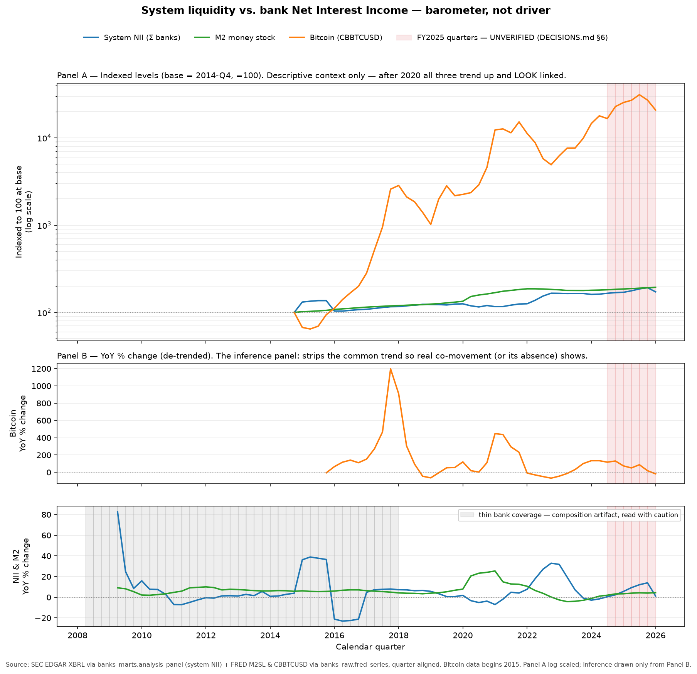
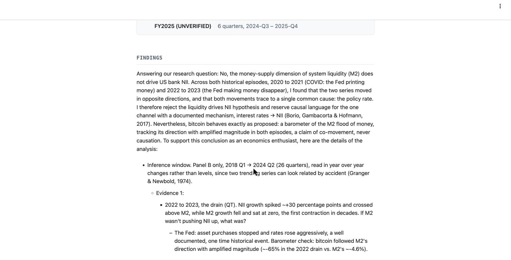

# Bank Liquidity Barometer

**The problem.** When the Fed floods the system with money, do banks earn more
from lending? It is the kind of claim that gets repeated on trading desks and
rarely tested against filed numbers. And if the money supply is what matters,
is there a live gauge for it that moves before the quarterly filings arrive?

**The decision.** Build the panel from primary sources a reviewer can pull
themselves: 171 US public banks' quarterly filings from SEC EDGAR, liquidity
series from FRED, bitcoin as the candidate barometer. Model changes, never
levels, because two trending series look related by accident. Impute nothing.
When no free gold series survived four attempts, drop gold and say so rather
than substitute.

**The result.** No. Across both episodes in the sample, the 2020-21 flood and
the 2022-23 drain, M2 and bank net interest income moved in opposite directions,
and both trace to the policy rate. The one causal channel with a mechanism is
rates, not money supply. Bitcoin did behave as a barometer: it followed M2's
direction with amplified magnitude in both episodes (about -65% against M2's
-4.6% in the 2022 drain). Co-movement, never causation.

**Built by** Emanuel Medina Pinzon, individual coursework for *Dealing With Data*
(Prof. Panos Ipeirotis), NYU Stern MSBAi, July 2026.



**Run the checks (Python 3.12+):** `pip install -r requirements.txt && pytest` · **Regenerate the figure:** `python analysis/liquidity_overlay.py --csv analysis/liquidity_overlay_data.csv --out /tmp/overlay.png`

---

## How to read the figure

Panel A is the trap: indexed to 100 at 2014-Q4, all three series trend up
together after 2020 and look linked. Panel B strips the common trend by taking
year-over-year change, and that is the only panel inference is drawn from. The
grey band marks quarters where fewer than 160 banks report, so the system-NII sum
is a composition artifact, not economics. The red band marks the six FY2025
quarters whose filings were not independently reconciled.

The full reading of the evidence, in plain business terms, with every place a
careful reader should stay skeptical, is in [`DECISIONS.md`](DECISIONS.md).
The one-page report as it was delivered is [`index.html`](index.html).



## The data product

```
KBWB + KRE ETF holdings          175 distinct tickers, 4 excluded (no SEC XBRL) -> 171 banks
SEC EDGAR companyfacts (XBRL)    10-Q / 10-K facts per CIK, landed verbatim as STRING
FRED                             M2SL, FEDFUNDS, T10Y2Y, CBBTCUSD
  |
banks_raw      verbatim landing, nothing typed, nothing dropped
banks_clean    typed, restatements resolved to the latest filing, discrete quarterly facts
banks_marts    bank x fiscal-quarter panel: 10,247 rows, 171 banks, 2008-Q2 to 2026-Q1, 55 columns
  |
analysis/liquidity_overlay_data.csv   72-quarter system snapshot, committed
analysis/liquidity_overlay.py         the figure, from BigQuery or from the CSV
```

| file | why |
|---|---|
| [`DECISIONS.md`](DECISIONS.md) | why the study holds up, and where it does not |
| [`docs/cleaning_log.md`](docs/cleaning_log.md) | every exclusion, derivation and alignment, with its reason |
| [`docs/data_dictionary.md`](docs/data_dictionary.md) | the 55 columns of the analysis panel |
| [`sql/verification.sql`](sql/verification.sql) | integrity, reconciliation and coverage checks, each with its committed result |
| [`sql/liquidity_overlay.sql`](sql/liquidity_overlay.sql) | the query behind the figure |
| [`tests/`](tests/) | seven checks against the committed snapshot, no cloud |

## What went wrong, and what came out of it

**Gold, four dead ends.** Gold was meant to be the second barometer. FRED
discontinued the LBMA series after a licensing change; stooq's CSV endpoint
answers with a bot challenge; Nasdaq Data Link is blocked by a WAF from the
build environment; the free Quandl dataset is now paid. Rather than force a
substitute, gold was dropped and M2 was promoted to a plotted series, which is a
better barometer for the question anyway. The four failures are recorded in
`DECISIONS.md` section 5.1.

**The loan figure changes basis at CECL.** There is no universal "total loans"
tag. Before 2020 the panel lands on a net-of-allowance tag; after, on a gross
tag. Three filers (JPMorgan among them) populate the concepts with inverted
values. `total_loans` is therefore not comparable across 2020 and is not used
in the finding; the break is documented instead of smoothed.

**0.54% of rows do not reconcile.** `interest income - interest expense = NII`
holds for 99.46% of testable rows. The rest is filers using slightly different
income-tag bases. It is labelled, not fixed.

**FY2025 is unverified.** The six most recent quarters rely on the filed XBRL
alone. They are flagged in the data, shaded in the figure, and excluded from the
inference window (2018-Q1 to 2024-Q2, 26 quarters).

## Run it without the cloud

```bash
# Python 3.12 or newer
pip install -r requirements.txt
pytest                                                   # 7 tests, seconds, no credentials
python analysis/liquidity_overlay.py --csv analysis/liquidity_overlay_data.csv --out /tmp/overlay.png
streamlit run app/streamlit_app.py                       # the report, on localhost
```

The tests pin what would be expensive to get wrong: 72 quarters with no gaps,
no imputed NII or M2, bitcoin null before 2014-Q4, the thin-coverage window, the
six unverified quarters, and that the figure regenerates from the committed CSV.
One of them was proved to go red by imputing zeros into bitcoin's early quarters.

## Rebuilding the panel

Only if you want to rebuild from source. You need a GCP project with BigQuery, a
free FRED API key and a descriptive User-Agent for SEC EDGAR; see
[`.env.example`](.env.example). A 200 GB per-query cap was enforced on every
query during the build and is set in `analysis/liquidity_overlay.py`.

## What this is not

- **Not a causal study.** Causal language is reserved for rates to NII, the one
  channel with a documented mechanism (Borio, Gambacorta and Hofmann, 2017).
  Bitcoin is a barometer of the same weather, not the cause of it.
- **Not a long time series.** 72 quarters, 26 in the inference window. The
  cross-section is wide; the time dimension is thin. Suggestive, not settled.
- **Not a professional's verdict.** The author is an enthusiast of these topics,
  not a finance professional, and the conclusions are an analyst's exploration.
- **Not a live service.** The Cloud Run deployment was retired in September 2026.

## Data and sources

SEC EDGAR companyfacts API (10-Q/10-K XBRL, public). FRED (Federal Reserve Bank
of St. Louis, public). ETF holdings from the issuers' published constituent
lists. No personal data anywhere in the pipeline.

## Built with

Python, BigQuery, pandas, matplotlib, Streamlit. Built with the Claude Code CLI
in a pull-request workflow; the git history is the audit trail.
